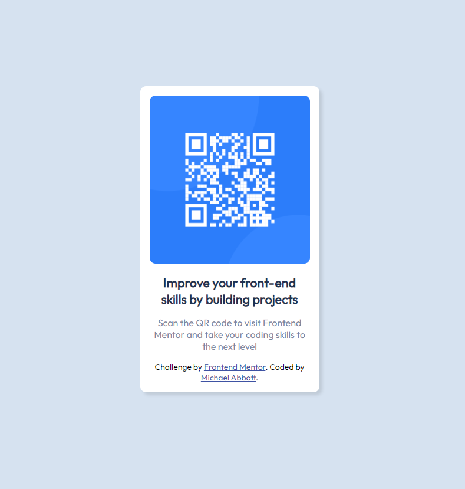

# Frontend Mentor - QR code component solution

This is a solution to the [QR code component challenge on Frontend Mentor](https://www.frontendmentor.io/challenges/qr-code-component-iux_sIO_H). Frontend Mentor challenges help you improve your coding skills by building realistic projects. 

## Welcome! 👋

## Table of contents

- [Overview](#overview)
  - [Screenshot](#screenshot)
  - [Links](#links)
- [My process](#my-process)
  - [Built with](#built-with)
  - [What I learned](#what-i-learned)
- [Acknowledgments](#acknowledgments)

## Overview

### Screenshot



Hi! Here is a simple QRCode pane that I have created with inspiration from the FrontendMentor.io challenge. 

### Links

- Challenge URL: [FrontendMentor.io](https://www.frontendmentor.io/challenges/qr-code-component-iux_sIO_H)
- GH Pages URL: [GH Pages](https://your-live-site-url.com)

## My process

### Built with

- Semantic HTML5 markup
- CSS custom properties
- Flexbox

### What I learned

Great CSS and Flexbox practice which never comes in wrong. 


```css
body {
	background-color: hsl(212, 45%, 89%);
	font-size: 15px;
	font-family: 'Outfit', sans-serif;
	display: flex;
	flex-direction: column;
	align-items: center;
	justify-content: center;
	height: 100vh;
}
```


## Acknowledgments

Thanks for looking!

